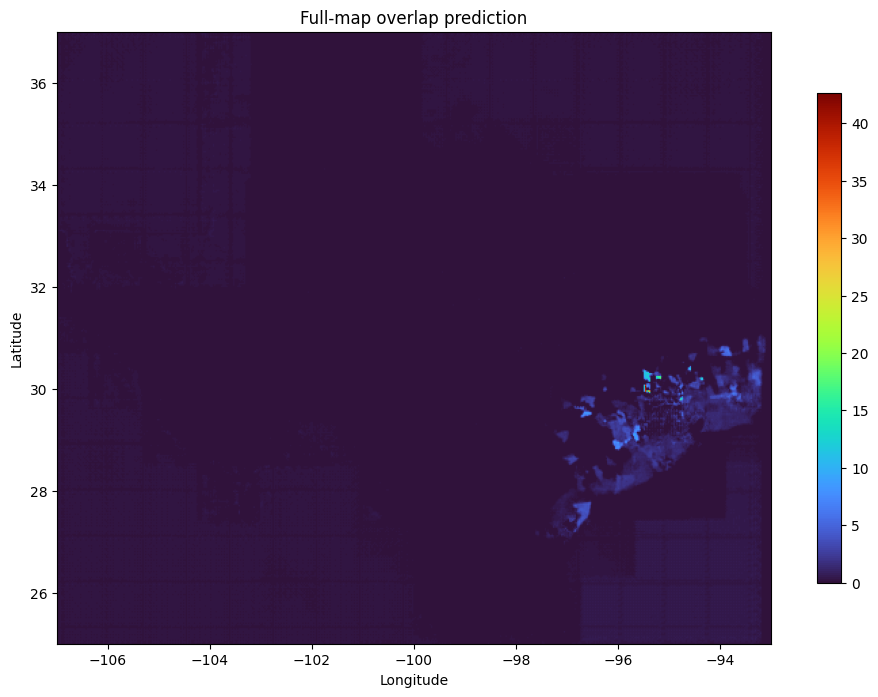

# Semantic Social Sensing for Flood Depth Downscaling

## Overview

This repository provides a geospatial deep learning framework for high-resolution hurricane flood-depth prediction by integrating environmental variables with semantic information extracted from disaster-related social media.

Conventional social sensing approaches often represent social media information using tweet counts or keyword frequencies. Although these variables describe the intensity of social media activity, they do not preserve the disaster-related meaning contained in the text.

This project therefore transforms unstructured social media text into **spatial semantic raster representations** and integrates these representations with environmental predictors in a U-Net-based flood downscaling framework.

The overall workflow is:

**Social media text → disaster-impact semantics → spatial semantic rasters → environmental–semantic feature fusion → U-Net → 0.025° flood-depth prediction**

The framework is currently demonstrated using hurricane and flood observations across Texas.

---

## Workflow

<p align="center">
</p>


<p align="center">
  <b>Figure 1.</b> Overall framework for semantic social sensing and flood-depth downscaling.
</p>

The workflow contains four major components:

1. Environmental raster preprocessing and spatial alignment.
2. Semantic information extraction from disaster-related social media.
3. Conversion of tweet-level semantic information into spatial raster layers.
4. Integration of environmental and semantic predictors within a U-Net flood-depth downscaling model.

---

# 1. Data

## 1.1 Environmental Predictors

The flood downscaling model uses five environmental predictor channels:

| Channel | Variable           | Description                               |
| ------- | ------------------ | ----------------------------------------- |
| 1       | Coarse Water Depth | Coarse-resolution flood-depth information |
| 2       | Precipitation      | Storm-related precipitation               |
| 3       | Wind               | Storm-related wind conditions             |
| 4       | Elevation          | Ground elevation derived from DEM         |
| 5       | Slope              | Terrain slope derived from DEM            |

All predictors are spatially aligned to the target **0.025° grid** before model training.

---

## 1.2 Flood-Depth Target

Observed flood depth is used as the supervised prediction target.

The original water-depth observations are derived from the OpenFEMA dataset and represent flood-water depth associated with disaster assistance records.

Water depth is reported primarily in inches and includes geographic information at multiple administrative levels, including ZIP code, census tract, census block group, and census block.

The dataset used in this project is available at:

**DOI:** https://doi.org/10.7266/n90stx2y

---

## 1.3 Social Media Data

Each social media observation contains textual information and a geographic bounding box:

```text
tweet text

lon_min
lat_min
lon_max
lat_max
```

Unlike point-geotagged observations, these tweets may represent geographic areas of different sizes.

The bounding box is therefore explicitly incorporated into the spatial semantic mapping procedure rather than reducing every tweet to its centroid.

---

# 2. From Tweets to Spatial Semantic Representations

A central component of this project is the transformation of unstructured social media text into raster-based semantic information that can be directly incorporated into geospatial deep learning.

<p align="center">
</p>


<p align="center">
  <b>Figure 2.</b> Transformation of tweet text and geographic bounding boxes into multi-channel semantic raster representations.
</p>

The procedure consists of three steps.

### Step 1 — Semantic inference

Each tweet is processed using a disaster-impact language model.

Instead of representing a tweet using only its presence or frequency, the model generates probabilities for multiple disaster-impact categories.

Conceptually,

```text
Tweet text
      ↓
Disaster-impact language model
      ↓
Semantic probability vector
```

Examples of semantic dimensions include:

* flood damage,
* destroyed structures,
* roof damage,
* flood insurance,
* homeowners insurance,
* temporary shelter eligibility,
* rental assistance,
* repair assistance,
* replacement assistance, and
* personal property assistance.

---

### Step 2 — Spatial uncertainty weighting

Tweets have different geographic bounding-box sizes.

A small bounding box provides greater spatial precision than a large bounding box. A spatial precision weight is therefore calculated as

Larger bounding boxes consequently receive lower spatial weights.

---

### Step 3 — Semantic rasterization

The semantic vector associated with each tweet is distributed across the raster cells covered by its geographic bounding box.

Semantic information from overlapping tweets is subsequently aggregated within each raster cell.

The result is a multi-channel semantic feature cube:

```text
Semantic Channel 1 ─┐
Semantic Channel 2  │
Semantic Channel 3  │
        ...          ├──► H × W × K
Semantic Channel K ─┘
```

This representation preserves the spatial distribution of multiple disaster impacts rather than collapsing social media information into a single tweet-count raster.

---

# 3. Semantic Raster Outputs

The semantic rasterization procedure produces one raster channel for each disaster-impact category.

<p align="center">
  
  
</p>

<p align="center">
  <b>Figure 3.</b> Examples of spatial semantic raster layers derived from disaster-related social media.
</p>

The complete semantic raster is stored in channel-first format:

```text
(K, height, width)
```

and can be exported as a multi-band GeoTIFF.

Each band represents an individual semantic disaster-impact variable.

---

# 4. Environmental–Semantic Feature Fusion

After rasterization, the semantic layers are spatially aligned with the environmental predictors.

The environmental feature tensor contains:

```text
Coarse Water Depth
Precipitation
Wind
Elevation
Slope
```

while the semantic tensor contains the disaster-impact raster channels.

Conceptually:

```text
Environmental Features             Semantic Features

Coarse Water Depth                 Flood Damage
Precipitation                      Destroyed
Wind                               Roof Damage
Elevation                          ...
Slope                              Semantic Channel K

        │                                  │
        └──────────────┬───────────────────┘
                       ↓
                 Feature Fusion
                       ↓
                Multi-channel Input
                       ↓
                     U-Net
                       ↓
             0.025° Flood Depth
```

Each feature channel is normalized independently before model training.

---

# 5. Flood-Depth Downscaling

A U-Net is used as the base prediction model.

The objective of this project is not to introduce a new U-Net architecture. Instead, the same prediction architecture is maintained across experiments so that the contribution of different social sensing representations can be evaluated independently from changes to the neural network.

The model receives the multi-channel raster tensor and predicts a continuous flood-depth surface at **0.025° spatial resolution**.

Training is performed using overlapping raster patches, while overlapping-window inference is used to reconstruct the final statewide prediction and reduce patch-boundary artifacts.

---

# 6. Balanced Block-Based Spatial Cross-Validation

Flood-depth observations are highly uneven across Texas. Conventional random train/test splitting can introduce spatial leakage because nearby raster cells may occur in both training and validation datasets.

Simply dividing Texas into five equal geographic regions can create another problem: the five regions may contain very different numbers of valid flood observations.

This project therefore uses a **balanced block-based spatial five-fold cross-validation strategy**.

<p align="center">
  
</p>

<p align="center">
  <b>Figure 4.</b> Balanced block-based spatial five-fold cross-validation based on the number of valid flood pixels.
</p>

The procedure is:

```text
Flood-depth target
        ↓
Identify valid flood pixels
        ↓
Divide raster into spatial blocks
        ↓
Count valid pixels within each block
        ↓
Assign blocks to five folds
        ↓
Balance cumulative valid-pixel counts
        ↓
Spatial five-fold cross-validation
```

Blocks are assigned iteratively to the fold currently containing the smallest cumulative number of valid flood pixels.

This approach attempts to achieve two objectives simultaneously:

* preserve spatial grouping during validation; and
* maintain comparable effective sample sizes among folds.

---

# 7. Experimental Design

Several input configurations can be evaluated under the same U-Net architecture and spatial cross-validation framework.

| Experiment | Environmental Features | Social Media Representation   |
| ---------- | ---------------------- | ----------------------------- |
| E0         | ✓                      | None                          |
| E1         | ✓                      | Tweet Count                   |
| E3         | ✓                      | Multi-channel Semantic Raster |
| E4         | ✓                      | Semantic Raster + Tweet Count |

This experimental design allows the contribution of semantic social sensing to be evaluated against both an environmental-only baseline and simpler social media representations.

Performance is evaluated using:

* Mean Absolute Error (MAE)
* Root Mean Squared Error (RMSE)
* Coefficient of Determination ((R^2))

---

# 8. Results

Following model selection and cross-validation, the selected model is trained using the available supervised observations and applied to the complete study domain.

<p align="center">
  
</p>

<p align="center">
  <b>Figure 5.</b> Final flood-depth prediction at 0.025° spatial resolution.
</p>

The final output is a georeferenced raster representing predicted flood depth across the study area.

---
